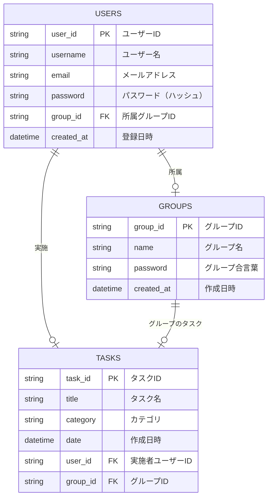

```mermaid
erDiagram
USERS {
  string user_id PK "ユーザーID"
  string username "ユーザー名"
  string email "メールアドレス"
  string password "パスワード（ハッシュ）"
  string group_id FK "所属グループID"
  datetime created_at "登録日時"
}
GROUPS {
  string group_id PK "グループID"
  string name "グループ名"
  string password "グループ合言葉"
  datetime created_at "作成日時"
}
TASKS {
  string task_id PK "タスクID"
  string title "タスク名"
  string category "カテゴリ"
  datetime date "作成日時"
  string user_id FK "実施者ユーザーID"
  string group_id FK "グループID"
}

USERS ||--o| GROUPS : "所属"
USERS ||--o| TASKS : "実施"
GROUPS ||--o| TASKS : "グループのタスク"
```
